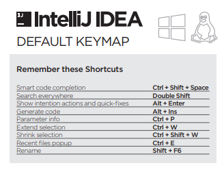
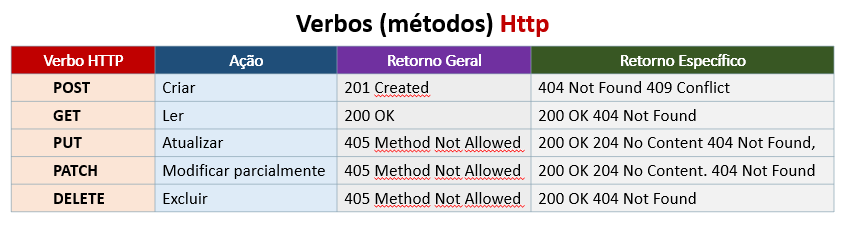

<h1 align="center">
:small_red_triangle_down: API REST em Java com Spring Boot - Gerenciador de Estoque de Cerveja
</h1>

<h2 align="center">
Bootcamp everis Fullstack Developer pela Digital Innovation One
</h2>

  

  

O objetivo deste projeto é desenvolver uma API em Java com Spring Boot para efetuar testes unitários de validação num sistema de gerenciamento de estoques de cerveja.

  <a href="#gem-conteudo-do-curso">Conteúdo do Curso</a>&nbsp;&nbsp;&nbsp;|&nbsp;&nbsp;&nbsp;
  <a href="#rocket-tecnologias">Tecnologias</a>&nbsp;&nbsp;&nbsp;|&nbsp;&nbsp;&nbsp;
  <a href="#books-aprendizado">Aprendizado</a>&nbsp;&nbsp;&nbsp;|&nbsp;&nbsp;&nbsp;
  <a href="#computer-instalação">Instalação</a>&nbsp;&nbsp;&nbsp;|&nbsp;&nbsp;&nbsp;
  <a href="#small_orange_diamond-compartilhando">Compartilhando</a>&nbsp;&nbsp;&nbsp;|&nbsp;&nbsp;&nbsp;
  <a href="#small_orange_diamond-licença">Licença</a>&nbsp;&nbsp;&nbsp;|&nbsp;&nbsp;&nbsp;
  <a href="#small_orange_diamond-agradecimentos">Agradecimentos</a>

## :gem: Conteúdo do Curso
 1. Reforçado os princípios REST e o modelo de maturidade de Richardson para RESTFull (Glory of REST).
 2. Apresentado a pirâmide de testes de software e os detalhes de cada nível:
      * Testes Unitários (custo menor) – menor unidade da aplicação, por exemplo, uma classe isolada.
      * Testes de Integração(aumenta o custo) – para verificar se outra parte da aplicação não quebrará o código.
      * Teste de Usabilidade (o custo mais alto) – teste de ponta a ponta.
 3. Teste de consumo da API com o Postman.
 4. Implentado testes unitários da aplicação.
 5. Impementado breve a filosofia TDD (Test Driven Development).
 6. Teste geral dos testes unitários.

## :rocket: Tecnologias
Estas foram as tecnologias utilizadas neste projeto:
 * Spring Web
 * Spring Data JPA
 * H2 Database
 * Java
 * Maven
 * JUnit
 * Mockito
 * Hamcrest
 
## :books: Aprendizado
 - Revisado os principais conceitos e vantagens de se criar testes unitários.
 - Vantagens dos frameworks referência para testes: JUnit, Mockito e Hamcrest.
 - A importância dos testes unitários dentro do desenvolvimento: maior número de testes, menor custo e menor tempo.
 - Visão prática do desenvolvimento de funcionalidades com a prática do TDD.
 
## :computer: Instalação
1. Clone este repositório no seu computador:

    `$ git clone https://github.com/clovisdanielcosta/beer-rest-api.git`

2. Digite num terminal:

    `$ cd beer-rest-api`

3. Para executar o projeto no terminal, digite o seguinte comando:

    `$ mvn spring-boot:run`

4. Para executar os testes da aplicação, digite o seguinte comando:

    `$ mvn clean test`

5. Acesse o seguinte endereço para visualizar a execução do projeto:

    `http://localhost:8080/api/v1/beers`

## :small_orange_diamond: Compartilhando 
Atalhos para o IntelliJ (Reference Card).

[IntelliJ Reference Card](./docs/IntelliJIDEA_ReferenceCard.pdf) (pdf completo)

  

Mapa de métodos Http.

  

## :small_orange_diamond: Licença
Esse projeto está sob a licença MIT. Veja o arquivo [LICENSE](LICENSE.md) para mais detalhes.
A(s) imagem(s) usada(s) neste projeto são originais do autor ou foram obtidas através de sites de terceiros com a devida autorização para uso gratuito.

## :small_orange_diamond: Agradecimentos
Quero agradecer a <b>Digital Innovation One</b> e <b>everis</b>, também parabenizar o Rodrigo Peleias pelo excelente domínio do assunto durante as aulas. Parabéns, vocês estão fazendo um ótimo trabalho em favor da comunidade! 

Muito obrigado! :clap::clap:
